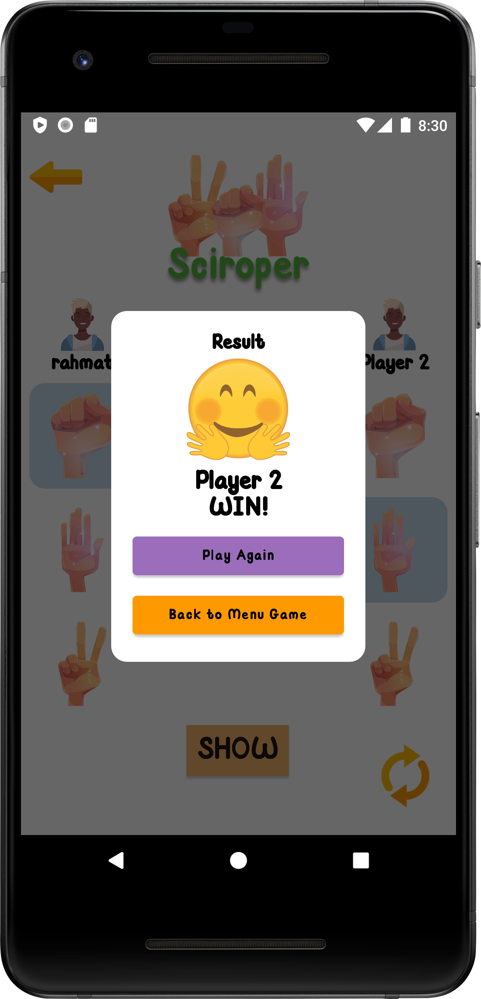

# Sciroper-MVP
Rock Paper Scissors game Android with MVP(Model-View-Presenter)

This project was developed by several people, if you want to see who it is, [click here](https://github.com/riskiilyas/Sciroper-CC6/graphs/contributors)

## Components:
- View Pager2
- Glide 
- Dots Indicator
- Room-Coroutine
- Lottie
- Circle Image
- View Binding
- RecyclerView
- SharedPreferences

## Screenshot

  
  
  
  
  
  
  
  
  
  
  
  
  
  
  

